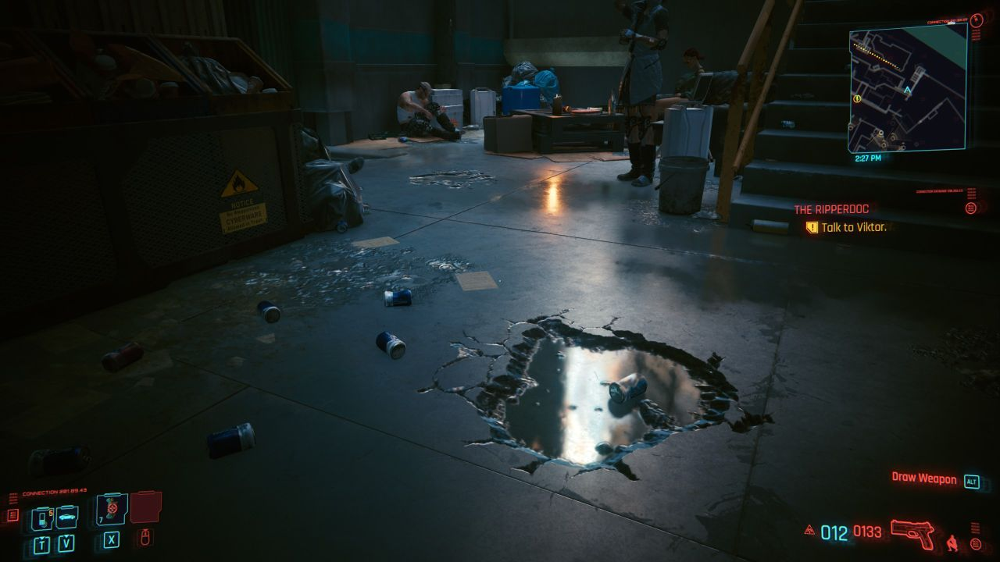

* content
{:toc}
# 欢迎来到夜之城，V

大家好，失踪人口小张回归了，失踪的这段日子里发生了一些事（比如我离开了 NVIDIA），这些事回头慢慢聊。今天，乘着`赛博朋克2077`的热点还在，小张想先聊聊实时光线追踪（下文省略为 RTX）里的一个知识点——BVH 包围盒子（RTX 和 BVH 将是本文唯二的两个术语）。RTX 的开发风格特别硬核，英文缩写不胜可数，繁文缛节苦不堪言。脱离代码在中文的语境里聊，更是容易引起场面尴尬，这次小张先拿游戏里的夜之城场景作为切入点试试手，如果没崩，日后接着聊 SBT、RTPSO 等更硬核的知识点。

有部分读者是被我的标题骗进来的，不懂图形没关系。这篇文章足够接地气，看完后你可能会爱上图形渲染。我想通过这篇文章传达的信息其实已经在标题里都写好了，正文的内容都是为了提供论点来支撑标题里抛出的观点，下面的内容你们看完忘记也没事，记住这个标题，尤其是前五个字。

> 大力出奇迹

# 真假反射

`赛博朋克 2077`可能是将 RTX 技术推广得最成功的一款游戏，水面、玻璃、金属，这些老黄发布会上最爱的视觉元素和谐地充斥在`赛博朋克 2077`的场景中，即位于美国西海岸的夜之城（Night City）。RTX 打破了传统绘制方式的局限性，即 `绘制场景中某一个物体时，无法获得周围其他物体的信息`。为了绕开这个限制，过往的图形程序员们发明了各种奇技淫巧来增加真实感。比如地面的反射，在 RTX 的`真反射`出现前，游戏中普遍用的是`伪反射`。`伪反射`通常基于屏幕上出现的颜色来伪造反射，对于屏幕外的颜色值无能为力。

作为对比，我们看下`真反射`，屏幕中下方的小水坑中能观察到屏幕以外的颜色值。

我们做下推理，`假反射`看不到是因为传统方式无法访问周围场景，`真反射`能看到则是因为它可以。在 RTX 中访问周围场景的一束束光线，光线与场景中（海量）三角形的相交是个非常暴力的操作。在直奔主题前，我们虚构一个简单场景来帮助理解光线和场景的关系，这个场景里只有两面格子墙、一盏灯和一个灰色的光滑小球。光线打到光滑的球面上并没有停止，而是继续弹射多次（次数与帧率成反比），弹射过程中的颜色值都会贡献到小球表面的颜色值。通过光线的弹射来获取周围场景的颜色值，便是`真反射`的核心。

回到`赛博朋克 2077`，小张的 RTX 2080 Super 在打开光追后显存都不够用，于是猜测开发商 CDPR 采用了非常暴力的方式来保存场景。有了这么一个猜测，下一步便是掏出小张的工具箱来验证它。

你看这个盒子，它又大又方
==

小张从工具箱里选出了三个工具：

- RenderDoc，失败，并不支持 RTX
- 微软 PIX，失败，不支持 Steam 启动的游戏
- 老东家 NVIDIA 的 Nsight Graphics，可行! 有一定几率游戏会挂，但是可行。

----
vinjn.com - Democratizing Visual Computing

